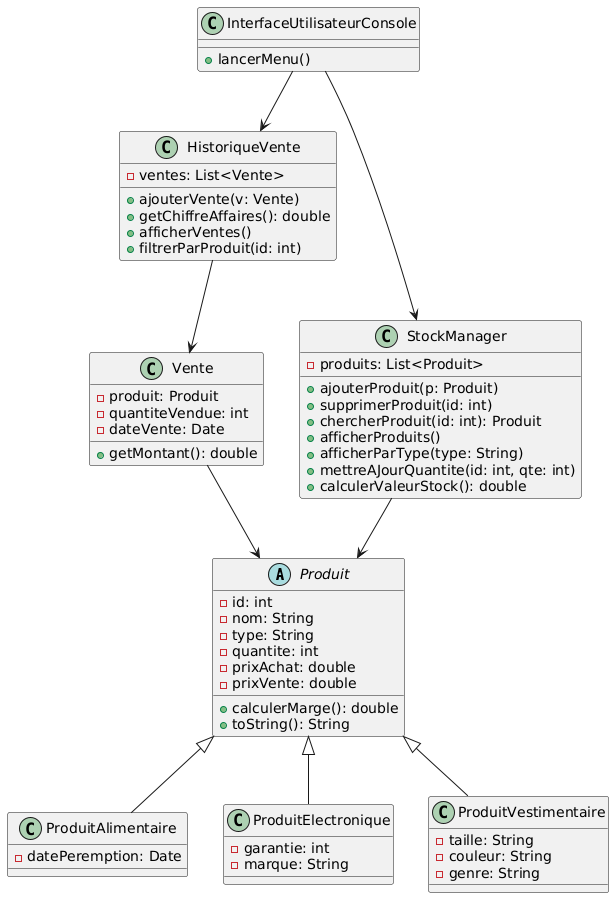

# StockManager

## 1. Introduction

Ce projet a pour objectif de développer une application de gestion de stocks permettant de gérer les opérations courantes telles que l’ajout, la suppression, la recherche de produits, ainsi que la gestion des ventes. Deux versions de l'application sont proposées :  
- Une version console.  
- Une version avec interface graphique (GUI).  

Ce projet a été conçu dans le but de mettre en pratique et de renforcer mes compétences en programmation orientée objet.

### Lancement du projet

La compilation se fait via `make` :
- **Version console** : `make console`  
- **Version interface graphique** : `make interface`  

## 2. Modélisation UML

Le diagramme UML ci-dessus présente deux grandes catégories de classes :  
- Les classes liées à la logique métier (gestion de stock, ventes, produits).
- Les classes dédiées à l'interface graphique.

### Principales classes du projet

- `StockManager`  
- `Vente`  
- `HistoriqueVente`  
- `Produit` (classe mère)  
  - `ProduitAlimentaire` (classe fille)  
  - `ProduitElectronique` (classe fille)  
  - `ProduitVestimentaire` (classe fille)  

#### StockManager

Il s'agit de la classe principale responsable de la gestion du stock. Elle permet d’ajouter, supprimer et rechercher des produits, entre autres fonctionnalités.

#### Vente

Classe représentant une vente. Elle contient les informations suivantes :
- Le produit vendu  
- La quantité vendue  
- La date de la vente  

#### HistoriqueVente

Cette classe conserve une liste des ventes effectuées, en utilisant des objets de type `Vente`. Elle permet ainsi de suivre l'historique des transactions.

#### Produit

Classe abstraite représentant un produit générique. Elle est héritée par des classes spécifiques selon le type de produit :
- `ProduitAlimentaire` pour les produits de consommation,
- `ProduitElectronique` pour les appareils électroniques,
- `ProduitVestimentaire` pour les vêtements.

## 3. Conclusion

Ce projet m'a permis d'explorer toutes les étapes de conception d'une application orientée objet, de la modélisation UML jusqu'à la mise en œuvre d'une interface graphique. Il illustre l'application concrète des concepts de l’héritage, de l'encapsulation et de la modularité. En plus de la version console, l'ajout d'une interface graphique améliore l’expérience utilisateur et ouvre la voie à de futures évolutions du projet.
